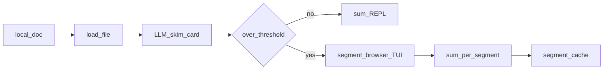
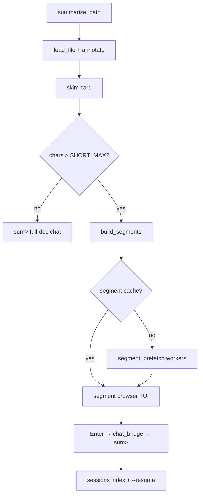
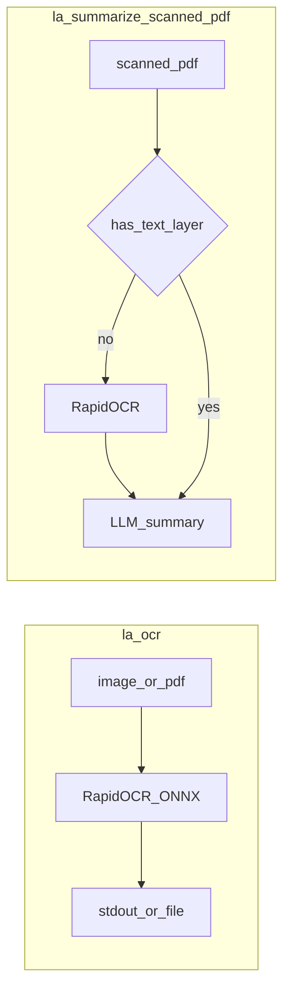
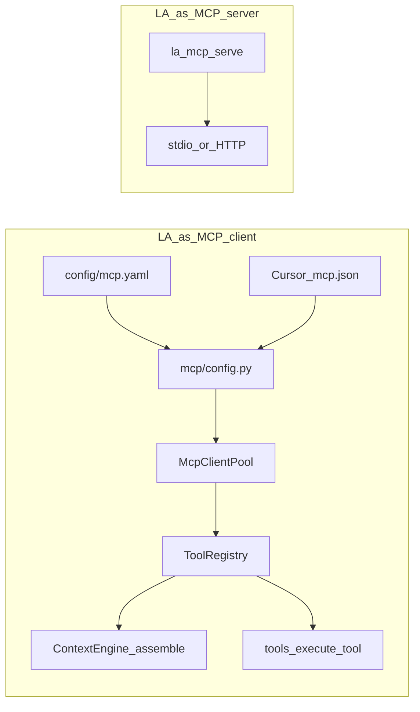
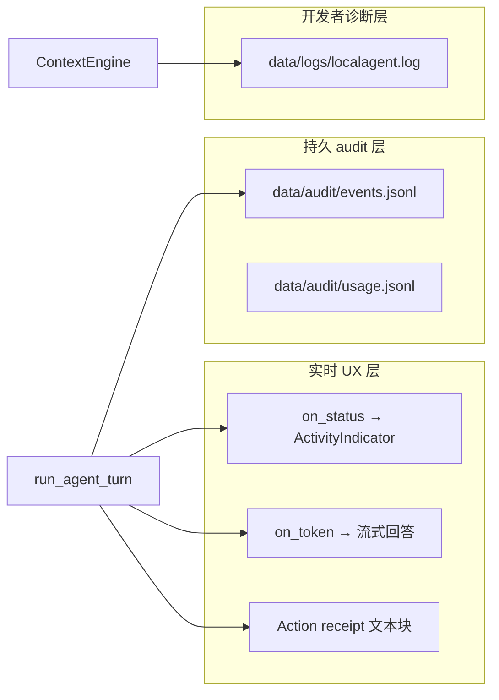
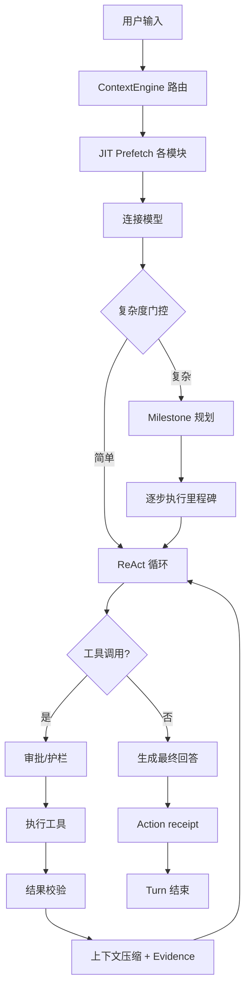

# LocalAgent 技术设计文档（TDD v1）

产品叙事真源见 [PRD.md](PRD.md)：**栖居在你电脑里的 AI。** · **本地优先，真记得你，把事办完。**（一句话优先，三板斧为特性拆分）

## 0. 产品三支柱 → 子系统

| 支柱 | 子系统 | 关键模块 |
|------|--------|----------|
| **Local First** | 配置 / 模型路由 / 纯本地路径 / 可选 MCP | `cli.py` · `setup` · `config` · `models/router.py` · `mcp/*` |
| **Memory Forever** | Hot / Warm / Cold + pending + rerank | `memory/*` · `knowledge/*` · `knowledge/rerank.py` · `pending/*` · `ingest/*` |
| **Actions Automated** | 工具循环 · Context Engine · Planner · Validation · MCP · 旁路 · 定时 · 回执 · 确认门 | `agent/runtime.py` · `agent/react_loop.py` · `agent/planner/*` · `agent/validation/*` · `context/*` · `mcp/*` · `tools/*` · `persist/session_work.py` · `summarize/` · `ocr_cmd.py` · `news/` · `writing/` · `aware/` · `status/` · `audit/` |

Actions 三档：旁路快捷（summarize / **ocr** / news / polish / aware）· Agent 工具循环（`run_shell` / `write_file` + Action receipt + session approve-once）· 定时（`news schedule` · `aware schedule`）+ Daily Actions / 数据层表面（`la status`·`/status` / 欢迎横幅）。

## 1. 架构

```
LA CLI → chat REPL / ingest / pending / status
         ↓
    LangGraph Agent (JIT tools)
         ↓
    ModelRouter (Ollama → OpenRouter → Cursor)
         ↓
    Hot: core_profile.json
    Warm: Mem0 (fallback: JSON memory_store)
          ├─ hybrid recall (+ optional SQLite hop expand)
          └─ optional Neo4j Cypher (counts / aggregations / multi-hop)
    Cold: Chroma + BM25 + RRF
         ↓
    Actions: tools + approval gate + action receipt
```

精确问（多少次/列出所有/同时提到）走 `query_memory_graph` → Cypher 模板 → 计算结果；开放语义问仍走 hybrid 文本召回。**Neo4j 默认关闭**（`LA_NEO4J=0`），与 `LA_MEMORY_GRAPH` 独立；仅在需要精确计数/聚合时再 `pip install 'la-localagent[neo4j]'` 并开启——符合「只摘低垂成熟果实」。

## 2. 模块结构

```
src/localagent/
├── cli.py                 # 全部 LA 命令（含 la ocr）
├── ocr_cmd.py             # run_ocr / render_ocr_result；CLI 与 loader 共用
├── chat_repl.py           # REPL + slash 命令 (/…)
├── session_commands.py    # 会话内 / 命令分发（与外层 CLI 共享）
├── agent/
│   ├── runtime.py         # run_agent_turn → ContextEngine → intent_route → planner | react_loop
│   ├── react_loop.py      # ReAct 工作记忆循环 + validation 链
│   ├── intent_route.py    # remember / continue / milestone / qa 内部路由
│   ├── prefetch_route.py  # JIT 预取模块路由（regex | hybrid）
│   ├── planner/           # milestone 规划 / 执行 / replan / checker
│   └── validation/        # 工具前后校验（programmatic + semantic）
├── context/               # Turn 级 Context Engine + 检索/压缩统一入口
│   ├── engine.py          # build_turn_context
│   ├── router/            # query 意图检测（regex）+ prefetch 路由 facade
│   ├── fetchers/          # JIT 预取（personal/archive 直连 RetrievalGateway）
│   ├── retrieval/         # Warm/Cold 检索门面（tools 与 fetcher 共用）
│   ├── compress/          # Observe 启发式压缩
│   └── working_memory.py  # ReAct turn evidence
├── models/router.py       # 三级模型回退
├── memory/
│   ├── core_profile.py    # Hot 层
│   ├── backend.py         # MemoryBackend 工厂
│   ├── backends/
│   │   ├── json_backend.py
│   │   └── mem0_backend.py
│   ├── temporal_intent.py
│   ├── scoped_recall.py
│   ├── value_filter.py
│   ├── compile/           # Hot profile 编译（resume 等；CLI 待产品化）
│   │   ├── engine.py
│   │   └── resume.py
│   └── graph/             # SQLite hop + Neo4j precise Cypher
│       ├── store.py       # SQLite MemoryGraphStore
│       ├── neo4j_store.py
│       ├── precise_query.py
│       ├── cypher_templates.py
│       └── cypher_guard.py
├── knowledge/
│   ├── chroma_store.py
│   ├── bm25_store.py
│   ├── hybrid.py
│   ├── rerank.py          # cross-encoder / embed / llm rerank
│   └── indexer.py
├── mcp/                   # MCP client + LA reverse serve
│   ├── config.py          # mcp.yaml + Cursor mcp.json 合并
│   ├── client_pool.py     # 持久连接池（stdio / HTTP）
│   ├── tool_registry.py   # builtin + MCP 工具合并与 execute
│   ├── schema_adapter.py
│   └── serve.py           # la mcp serve
├── mcp_cmd.py             # la mcp list|test|tools|serve
├── ingest/                # unified LA ingest engine (persist→Cold→Warm→Hot) + doc pipeline
│   ├── ocr.py             # RapidOCR 封装：ocr_image / ocr_pdf（PyMuPDF 渲染）
│   └── loader.py          # 统一 load_file；扫描 PDF OCR 回退；MOBI/EPUB（ingest/ebook.py）
├── summarize/             # la summarize：短路径卡片 + 长文档分段 + DocumentChatREPL（sum>）
│   ├── document.py        # 速读卡、annotate、分段入口
│   ├── segment_reader.py  # 分段策略、段摘要、跨段 RAG 检测
│   ├── browser.py         # 段列表 TUI（prompt_toolkit）
│   ├── nav.py             # TUI 导航状态
│   ├── segment_prefetch.py# 后台并行段摘要
│   ├── segment_cache.py   # 段摘要磁盘缓存
│   ├── repl.py            # sum> REPL、resume 重建
│   ├── sessions.py        # --list / --resume 会话索引
│   └── chat_bridge.py     # TUI Enter → 段深聊
├── news/                  # 新闻嗅探：RSS sync / brief TUI / read / schedule / notify
├── writing/               # la polish：场景润色 + 剪贴板
├── pending/               # 记忆写入确认门
├── status/                # Daily Actions + 数据层（la status / 横幅摘要）
├── aware/                 # 本机感知：传感器 tick · Episode · aware> 注入
├── persist/               # conversations jsonl + sessions.db + *.work.json
├── workspace/             # git / recent files / todos
├── audit/                 # usage log, security scan, reports
└── tools/                 # approval · action_receipt · shell · … + news_*
```

**Aware 浏览器语义**：`selected tab ≠ viewing`。打开标签里的选中页只表示「仍选中」；`dwell` / `browser.active` 仅在该浏览器为 OS frontmost（正在看）时累加；后台选中发 `browser.selected`，不涨时长。

## 3. 数据目录

```
data/
├── kb/                  # 软链接
├── core_profile.json
├── news/                # articles.sqlite · news_profile.json · sync_state.json · cache/
├── aware/               # events · episodes · suggestions · profile · cursors
├── sync_index.json
├── pending_queue.json
├── conversations/*.jsonl
├── sessions/            # sessions.db · {session_id}.work.json（跨 turn 任务续跑）
├── chroma/
├── mem0/                # Mem0 qdrant + history.db
├── bm25.pkl
└── audit/usage.jsonl
```

## 4. 关键设计决策

| 决策 | 选型 |
|------|------|
| 产品边界 | 只做本地 agent：数据留本机，本地可完整跑通；联网与云端模型为可选增强（见 PRD 章程） |
| Warm 写入确认 | `LA_MEMORY_APPROVAL_REQUIRED`（默认开）：非交互提取入 `pending_queue.json`；`approve`/`reject`；`LA_MEMORY_APPROVAL_AUTO=1` 跳过（CI） |
| 记忆引擎 | Mem0（主依赖）+ JSON fallback / 注册表 |
| 知识检索 | Chroma + BM25 + RRF；文档与对话归档入 Cold |
| 一键总结 | 短路径（1～3 句 + 〔§/p.〕）+ **长文档分段**（段 TUI / prefetch / 段缓存 / 跨段 RAG）；TTY 默认 `DocumentChatREPL`（`sum>`）或段浏览器；`--list`/`--resume`；默认不入库；`SUMMARIZE_SUFFIXES` 含 mobi/epub，不含图片 |
| 本地 OCR | `ingest/ocr.py` + `ocr_cmd.py`；RapidOCR（PP-OCRv6 / ONNX）；`la ocr` 旁路；扫描 PDF / ingest doc 内嵌 OCR；`pyproject.toml` `[ocr]` extra；`LA_OCR_*` 见 `env.example`；测试 `tests/test_ocr.py`（mock） |
| 新闻嗅探 | BestBlogs RSS → SQLite；兴趣重排；`brief` TTY 用 prompt_toolkit 浏览器（↑↓ / o→webbrowser / r→精读+DocumentChatREPL）；launchd/cron 早 8 点 sync；chat 启动就绪通知 |
| 一键润色 | `writing/polish.py` 旁路 Agent；场景/态度识别 → 主推+备选；默认 `clipboard.copy_text` |
| Aware 本机感知 | 按源 opt-in（`fs`/`git`/`terminal`/`browser`/`apps`）；tick → Episode；可索引文件仅 suggestion；`approve` 白名单（`ingest doc\|text` / `summarize`）；**不自动写 Cold/`kb/`**；browser selected ≠ viewing；相关 chat 注入近时 Episode |
| 编排 | LangGraph + SQLite Checkpointer |
| 联网 | **ddgs 默认**（无需 Key）；可选 Tavily / SearXNG |
| 模型 | Ollama 优先，OpenRouter/Cursor 降级 |
| MCP 集成 | `mcp/` client + `ToolRegistry` 合并 builtin/MCP；`config/mcp.yaml` + 可选 Cursor 导入；`[mcp]` extra；见 §4.2 · PRD §4.12 |
| 召回 Rerank | `knowledge/rerank.py`；cross-encoder / embed / llm；`LA_MEMORY_RERANK_*`；`[rerank]` extra |
| Agent 执行 | Context Engine JIT → intent_route → milestone planner \| ReAct；validation 链；session work 续跑；见 PRD §4.11 |

### 4.1 Summarize 数据流概览



### 4.1a 长文档分段数据流



依赖：`ingest/ebook.py`（MOBI/EPUB）、`segment_reader.py`、`browser.py`、`segment_prefetch.py`、`segment_cache.py`。配置见 `env.example` 中 `LA_SUMMARIZE_*`。

### 4.1b 本地 OCR 数据流（扫描 PDF）



| 模块 | 职责 |
|------|------|
| [`ingest/ocr.py`](../src/localagent/ingest/ocr.py) | `ocr_image` / `ocr_pdf`；RapidOCR + PyMuPDF |
| [`ocr_cmd.py`](../src/localagent/ocr_cmd.py) | `run_ocr` / `render_ocr_result` |
| [`cli.py`](../src/localagent/cli.py) | `la ocr`（`--out` / `--keep` / `--json`） |
| [`config.py`](../src/localagent/config.py) | `SUMMARIZE_SUFFIXES` 不含图片；`LA_OCR_*` |
| [`ingest/loader.py`](../src/localagent/ingest/loader.py) | PDF 文本层覆盖率低于 `LA_OCR_PDF_TEXT_RATIO` → OCR |
| [`summarize/document.py`](../src/localagent/summarize/document.py) | 图片后缀拒绝，提示 `la ocr` |

依赖：`pip install 'la-localagent[ocr]'`（`rapidocr` · `onnxruntime` · `pymupdf`）。配置见 [`env.example`](../src/localagent/resources/env.example)。

### 4.2 MCP 集成（PRD §4.12）

LA 同时扮演 **MCP client**（连接外部 tool server）与可选 **MCP server**（`la mcp serve` 对外暴露 LA 能力）。



| 模块 | 职责 |
|------|------|
| [`mcp/config.py`](../src/localagent/mcp/config.py) | 加载 `mcp.yaml`；`${env:…}` 插值；合并 Cursor `mcp.json`（`LA_MCP_IMPORT_CURSOR`） |
| [`mcp/client_pool.py`](../src/localagent/mcp/client_pool.py) | 后台 asyncio 线程；stdio / streamable HTTP 持久连接；`list_tools` 缓存 |
| [`mcp/tool_registry.py`](../src/localagent/mcp/tool_registry.py) | builtin + MCP 工具合并；`get_tool_definitions()` → ContextEngine；`execute()` 分发 |
| [`mcp/schema_adapter.py`](../src/localagent/mcp/schema_adapter.py) | MCP tool name/schema → LA 命名空间 |
| [`mcp/serve.py`](../src/localagent/mcp/serve.py) | LA 反向暴露；HTTP 需 `LA_MCP_SERVE_TOKEN` |
| [`mcp_cmd.py`](../src/localagent/mcp_cmd.py) | `la mcp list|test|tools|serve` |
| [`context/assemble.py`](../src/localagent/context/assemble.py) | Turn 组装时注入 MCP 工具定义 |
| [`tools/__init__.py`](../src/localagent/tools/__init__.py) | `execute_tool` → `ToolRegistry.execute` |
| [`agent/planner/tools_route.py`](../src/localagent/agent/planner/tools_route.py) | milestone 模式 BM25 工具子集（含 MCP） |

**配置路径**：`LA_MCP_CONFIG` → 否则 `config/mcp.yaml` → 否则 `~/.localagent/mcp.yaml`。示例见 [`mcp.yaml.example`](../config/mcp.yaml.example)。

**开关**：`LA_MCP_ENABLED=1`（默认）；未安装 `[mcp]` 或未配置 server 时不影响纯本地 builtin 路径。

**生命周期**：CLI 退出时 `ToolRegistry.shutdown()` 关闭连接池。

## 5. 时间召回

- `parse_temporal_intent` 分类意图：`range` / `as_of_now` / `when_event` / `duration` / `none`
- 有日历窗（`range`、`as_of_now`）时：锚点衰减 + scope 软奖惩；词法路径时间权重约 40%，Mem0 hybrid 约 20%
- `when_event`（When did…）：时间几乎不主导排序；默认自动扩 ±1 邻轮，靠事件关键词召回后由 LLM 读记忆日期作答
- scope 只做 soft boost（窗内 1.0 / 近窗 0.5 / 窗外 0.15），不硬过滤缺日期记忆
- **例外（归档时间浏览）**：用户问「某年某月问过哪些问题」时，Agent 预取对 Cold `recorded_at` 与 Warm `query_memories(time_field=recorded)` 做 **硬时间窗**；弱主题则按月列举会话摘要，禁止窗外语义噪音与臆造

## 6. 请求路径

```
用户输入 → Agent 循环（直接执行）
  ├─ JIT 预加载（画像 / 记忆 / 联网 / 工作区，合计受 LA_PREFETCH_BUDGET_CHARS 约束）
  ├─ 工具调用 → Observe 启发式压缩后再回填（LA_OBSERVE_BUDGET_CHARS；不额外调 LLM；见 §8.1）
  └─ write_file / run_shell 执行前确认
```

Turn 内进度与数据层库存分离：`on_status` / Action receipt 为**执行 trace**（§8）；`la status` / `/status` 为 **Hot/Warm/Cold/Aware 库存**（§8.1）。

天气地点：显式城市 → 档案 `居住地` → 记忆扫描 pin → 仍无则直接搜。

联网天气：`web_search` 在核对失败或命中歌词/教案等垃圾结果时自动换查询重试；agent 禁止未重试就交卷。

## 7. 记忆评测：STM / LTM

按「短期优先、长期可慢」分两套基准；产品仍是 Hot/Warm/Cold 三层，测评用 STM/LTM 二分。

| 测评层 | 产品承载 | 主基准 | 主指标 |
|--------|----------|--------|--------|
| **STM** | 当前 `history` + 近窗 `conversations/`（`LA_STM_WINDOW_HOURS`，默认 24h） | [`benchmarks/stm/`](../benchmarks/stm/README.md) | Routing / Session Hit / Coverage / Priority Win |
| **LTM-State** | Hot 画像 + Warm 事实 | LoCoMo Warm 诊断轨 + Hot 辅轨 | Warm-only hit@k；Profile Field Hit |
| **LTM-Detail** | Cold 对话原文/摘要 | LoCoMo 联合召回 | **Joint Warm∪Cold Evidence Hit@k**（主） |

分流规则（Agent JIT）：

1. `is_session_recall_query`（今天/刚才/本场/上次）→ STM：`context/fetchers/session`（滚动窗或上一场 session），不走向量、不预取联网
2. `is_archive_recall_query`（以前/问过…）→ `context/fetchers/archive`：Cold 归档硬窗 + Warm 补充；不预取联网
3. 个人/浏览/家庭记忆 → `context/fetchers/personal`：经 `RetrievalGateway` 联合 Warm + Cold（个人/家庭 Cold 用 `conversation_only`）；纯画像问不预取联网
4. 时效问（天气/新闻等）→ `context/fetchers/web`；受 `LA_PREFETCH_BUDGET_CHARS` 与 observe 压缩约束

**检索路径**：Agent 工具（`search_memory` / `search_knowledge` / `query_memories`）与 JIT fetcher 均委托 `context/retrieval/RetrievalGateway`，避免 tool 格式化后再压缩的双 pass。

**Turn 组装**：`run_agent_turn` 经 `ContextEngine.build_turn_context` 统一路由 → 预取 → 预算 → system prompt；`runtime._prefetch_*` / `_build_system_prompt` 保留为薄别名供测试与 benchmark 直接调用。

LoCoMo 主协议：`joint_recall`（Warm∪Cold RRF → dia_id 去重 → top-k）。`--mode warm_only|cold_only` 与 `--diagnostics` 仅作归因。STM 由 `tests/test_stm_benchmark.py` 进日常 `pytest` / CI；LoCoMo 可慢/夜间跑。

## 8. Observability（可观测性）

可观测性**不是单一模块**，而是三条平行通道，职责刻意分离（见 §0 三支柱 · Actions 子系统）：



| 通道 | 入口 | 用户可见内容 | 关键模块 |
|------|------|-------------|----------|
| **实时 status** | `[chat] …` 换行打印 | prefetch、连接模型、工具调用、生成/综合 | `ui/console.py` · `chat_repl.py` |
| **Turn 结果** | 回答末尾 | 副作用回执、里程碑 ✓/○ | `tools/action_receipt.py` |
| **事后 audit** | `la audit` | 工具决策、护栏、planner 事件 | `audit/events.py` |
| **诊断日志** | `la logs` | 路由模块、prefetch hit | `context/engine.py` |
| **产品 status** | `la status` / `/status` | Hot/Warm/Cold/Aware **库存**（非执行 trace） | `status/layers.py` |

### 8.1 命名约定（避免混淆）

| 名称 | 含义 | **不是** |
|------|------|----------|
| **`observe` / `agent/observe.py`** | ReAct **上下文压缩**（Observe 启发式裁剪，受 `LA_OBSERVE_BUDGET_CHARS` 约束；不额外调 LLM） | tracing / telemetry / 用户可见 status |
| **`Turn Evidence`** | ReAct 步内证据链（`EvidenceEntry`：step/tool/summary），仅注入 system prompt | 终端展示层 |
| **`status/` 包 · `la status`** | **数据层库存**（`DataLayerStatus`：Hot/Warm/Cold/Aware 计数与健康） | 单 Turn 执行 trace |
| **执行 trace** | 一次 `run_agent_turn` 的阶段树与步骤事件 | 数据层盘点 |
| **`/status`（REPL）** | 同 `la status`——Daily Actions + 数据层明细 | 本轮 Agent 在做什么 |
| **`/trace`（设计目标）** | 会话内开启 **verbose 执行 trace**（L1）；与 `/status` 语义正交 | 数据层 status |
| **`on_status` 回调** | Turn 内实时 UX 行（L0 默认） | audit 写入 |

文档与对话中表述 **Context Compress / Turn Evidence** 时，勿称 `observe` 模块为「tracing」。

### 8.2 分层可见（Tiered Visibility）

| 层级 | 受众 | 展示什么 | 不展示什么 |
|------|------|----------|------------|
| **L0 默认** | 普通用户 | 阶段 + 关键动作（见 §8.4 节点表） | 原始 tool JSON、完整 observation、路由分数 |
| **L1 verbose** | 进阶用户 | prefetch 命中模块、里程碑 i/N、validation warn/fail 摘要 | 完整 LLM messages、embedding 细节 |
| **L2 debug/audit** | 开发者/复盘 | `events.jsonl` 全链、`usage.jsonl`、guardrail 原因 | — |

原则：**默认不刷屏**；verbose 为 opt-in（`LA_TRACE=1` 或未来 `/trace on`），与现有 `ActivityIndicator` 换行 UX 一致（不用 `\r` 覆盖流式回答）。

### 8.3 Turn 阶段树

一次 `run_agent_turn` 的推荐节点树（UX 与 audit 的 checklist）：



与 Runtime 状态分层对照：

| 状态层 | 可观测性应回答的问题 |
|--------|---------------------|
| 跨会话持久 | 记忆/KB 是否被 prefetch **命中**（非库存计数） |
| 会话进程 | 当前 turn 第几轮 ReAct、approval gate 状态 |
| 单 Turn 临时 | prefetch 路由、evidence 步数、validation |
| session work | 里程碑 partial 进度、72h 续跑（`sessions/*.work.json`） |

`la status` 的 `DataLayerStatus` 继续负责**库存健康**；执行 trace 单独命名空间，避免与「数据层 status」混淆。

### 8.4 L0 / L1 / L2 节点对照表

| 阶段 | L0 status（i18n 键） | 缺口 | L1 verbose 建议展开 | L2 audit（现有 / 建议） |
|------|----------------------|------|---------------------|-------------------------|
| **路由** | — | 无路由摘要 status | `route_modules`, `route_confidence`, `route_source`（`TurnContext.metadata`） | 建议 `context.route` |
| **Prefetch** | `chat.status_prefetch_*`（仅命中时） | 未命中无「跳过 prefetch」 | `prefetch_hits`, `budget_chars` | 建议 `context.prefetch` |
| **连接模型** | `chat.status_connecting` | ✓ | `provider`, `model` | — |
| **规划** | — | **无实时**「规划 N 步 / 执行 i/N」 | `milestone.id`, `objective`, `done_when` 摘要 | 现有 `planner.milestone` · `planner.resume` · `planner.degraded` · `planner.replan` |
| **ReAct 生成** | `chat.status_generate` · `chat.status_generate_cold` | ✓ | `iteration` | — |
| **ReAct 综合** | `chat.status_synthesize` | ✓ | `iteration`, 上轮 tool 名 | — |
| **工具调用** | `chat.status_tool_call` · `chat.status_tool_call_plain` | ✓ | tool 名、截断 preview | 现有 `tool.decision` |
| **审批** | `chat.status_await_approval` | ✓ | approve-once 模式 | 合并在 `tool.decision` |
| **护栏** | —（拦截后 tool 不执行） | L0 无独立 status 行 | 拦截原因摘要 | 现有 `guardrail.triggered` |
| **校验** | — | **无用户-facing status**（仅 LLM 内 `【核对失败】` marker） | `ValidationResult.severity`, `markers`, 截断 `retry_hint` | 建议 `validation.result` |
| **上下文压缩** | —（刻意不对用户展示） | ✓ 设计如此 | observe budget、tier | — |
| **重复调用熔断** | — | L0 无 status | `repeat_breaker` 原因 | 现有 `agent.repeat_call_breaker` |
| **迭代耗尽** | — | L0 无 status | `max_iter`, `tool_count` | 现有 `agent.iteration_exhausted` |
| **记忆写入** | `chat.status_write_memory` | ✓ | pending vs 直写 | — |
| **Turn 结束** | Action receipt + `[via provider]` | milestone 进度仅在 receipt 末尾 | validation 摘要 | 建议 `turn.complete`（`duration_ms`, `tool_count`, `exhausted`） |

### 8.5 同构事件（TurnStepEvent 草案）

最佳实践：定义统一结构，一次 emit、多路消费（**设计目标，尚未全量实现**）：

```python
{
  "ts": "...",
  "turn_id": "...",
  "session_id": "...",
  "phase": "prefetch|plan|react|validate|memory|guardrail|receipt",
  "step": "context.route|tool.call|milestone.start|...",
  "level": "info|warn|error",
  "summary": "人类可读一行",      # → L0 on_status
  "detail": { ... },              # → L1 verbose / /last-turn
  "schema_version": 1
}
```

与现有 `log_event` 关系：

- L2 可直接 append 到 `data/audit/events.jsonl`（扩展 `type` 或统一为 `turn.step`）
- 现有类型：`tool.decision` · `guardrail.triggered` · `planner.*` · `agent.*` · `aware.*` · `kb.ingest`
- L0 的每一行 status 节点，理想状态下应对应一条 audit 事件，便于「用户看到一行 ↔ 日志里有一行」

Usage（`usage.jsonl`）单独追踪成本；validation 语义校验已记 `usage_command="validation"`，与 turn 步骤通过 `session_id` / 时间戳关联。

### 8.6 三条通道分工

**实时 UX（主路径）**

- `ActivityIndicator` 换行模式（`ui/console.py` `begin_streaming()`）：流式回答与 status 不互相覆盖
- Token 门控（`agent/runtime.py` `_make_answer_stream_gate`）：L0 不看 raw tool call；L1 verbose 才展示结构化摘要
- Action receipt 作为「事后确认」：副作用 + milestone ✓/○

**事后 audit（信任与复盘）**

- `la audit` 适合：安全（guardrail）、行为统计（工具频次）、规划异常（degraded/replan）
- 每个 L0 status 节点应有对应 audit 事件（可后写）

**诊断日志（开发者）**

- ContextEngine 的 `logger.info` 不替代用户 UX；保持 `--debug` / `LA_LOG_LEVEL=INFO` 门槛
- `la logs` 查：prefetch 路由、planner 降级、MCP 错误等

### 8.7 CLI 入口约定

| 入口 | 层级 | 语义 |
|------|------|------|
| `la status` / `/status` | 产品 | Daily Actions + **数据层库存** |
| `on_status` 行 | L0 | Turn 内实时阶段 |
| Action receipt | L0 | Turn 末副作用确认 |
| `LA_TRACE=1` / `/trace on`（设计目标） | L1 | verbose 执行 trace |
| `/last-turn`（设计目标） | L1 | 当前 session 最近 turn 步骤回放 |
| `la audit` | L2 | 事件流复盘；未来 `la audit --turn <id>` 过滤 |
| `la logs` | L2 | 开发者诊断 |

### 8.8 隐私与安全

- 副作用命令/路径在 status 与 audit 中截断（`_MAX_SUMMARY_LEN=240`）
- L0 不暴露 workspace 全文、system prompt 内 milestone 上下文（已在 `planner/executor.py` 仅注入 LLM）
- side-effect 工具 preview 最长 40 字符（`react_loop.py`）

### 8.9 反模式

1. **把 observation 全文打到终端** — 破坏流式 UX、泄露 workspace 内容、违背 observe budget 设计
2. **用 `\r` spinner 覆盖 status** — 与 token 流冲突
3. **把 `DataLayerStatus` 当 turn trace** — 用户会误以为 prefetch 失败
4. **仅 log 不 status** — prefetch 路由、validation 当前部分如此，L0 用户「看不见」
5. **引入重量级 OpenTelemetry 作为默认依赖** — 与 Local First 冲突；若需要，仅作可选 export
6. **用 `observe` 模块名指 tracing** — 应称「Context Compress / Turn Evidence」

### 8.10 非目标

- 不做分布式 trace
- 不默认暴露 LLM context / 完整 messages
- 不把 `la status` 扩展为 turn 回放（用 `/trace` / `la audit` 代替）

### 8.11 实现映射速查

| 关注点 | 实现位置 |
|--------|----------|
| Turn 编排 | `agent/runtime.py` `run_agent_turn` |
| ReAct + status | `agent/react_loop.py` |
| Milestone（缺实时 status） | `agent/planner/executor.py` |
| Prefetch status | `context/fetchers/__init__.py` |
| 路由 metadata（未暴露 UX） | `context/engine.py` |
| Validation（未 audit） | `agent/validation/` |
| 上下文压缩 / Evidence | `context/compress/core.py` · `agent/observe.py` |
| Audit 写入 | `audit/events.py` |
| REPL 接线 | `chat_repl.py` |

**后续实现优先级**（文档先行，代码迭代）：P1 L0 补齐 milestone/validation status → P2 `TurnStepEvent` + `LA_TRACE=1` + `/last-turn` → P3 audit 扩展 `context.*` / `validation.*`。
